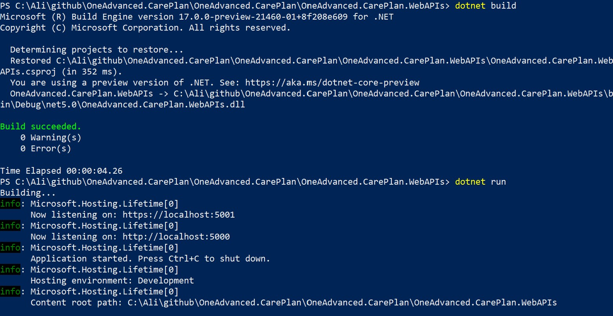
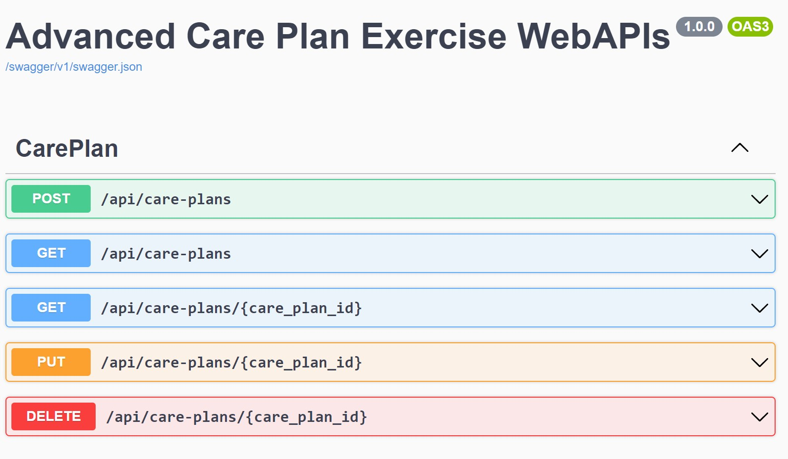
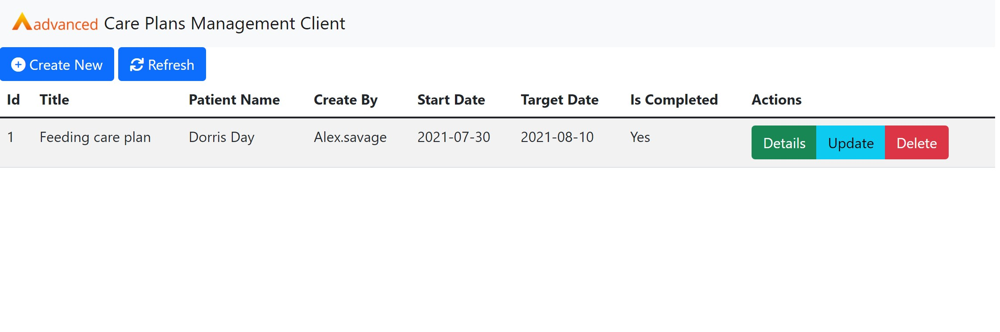

# OneAdvanced.CarePlan
## Introduction
This is my implementation for the coding exercise that was asked by the Advanced company. This project consists of an ASP.NET 5 web API server and an HTML based client.
<br>
First, I explain what steps I took to create a complete CRUD Web API (REST API) for the Care Plan management application. Second, I provide installation instructions for launching Web Server and HTML Client.

## Identifying an API’s goals
First, we need to clarify the application requirements based on the user story. Arnaud Lauret in his great book “The Design of Web APIs” proposes a comprehensive conceptual structure for extracting API's goals from user stories. He also continues his book by transforming these goals to specific APIs. Here, I used his approach for identifying the Care plan application goals and APIs.
<br>
Below is the list of care plan management requirements:

| Whos         | Whats                        | Hows                           | Inputs(Source)                                            | Outputs(Usage)                                | Goals                                                |
|--------------|------------------------------|--------------------------------|-----------------------------------------------------------|-----------------------------------------------|------------------------------------------------------|
| Care manager | Create and manage care plans | Add care plan                  | Add a new care plan(care plan information of the clients) | Added care plan(get, update, delete, replace) | Add care plan to stored records                      |
|              |                              | Get care plan’s information    | Care plan’s key(add, get all)                             | Care plan(update, replace)                    | Get information for a care plan                      |
|              |                              | Get all care plans information | Optionally filter on a patient name(add, get, get all)    | Care plans(get, get all, update, replace)     | Get information for all stored care plans            |
|              |                              | Update Plan’s information      | Care plan(add, get, get all)                              |                                               | Update care plan(totally replace an existing record) |
|              |                              | Replace*                       | Care plan(add, get, get all)                              |                                               | Replace care plan                                    |
|              |                              | Remove plan                    | Id of the care plan(add, get, get all)                    |                                               | Delete care plan                                     |

> For the sake of simplicity, “Replace” is removed.

## Transposing goals to REST APIs
By using the extracted goals, we can now define each REST API. Here, I transpose goals into resource and action pairs. The resource is identified by paths, and actions are represented by HTTP methods. After that, I identified parameters and return arguments for each pair of resources and actions. In the table below, I summarize these:

| Goals                                     | REST APIs                                  | Parameters                                                |
|-------------------------------------------|--------------------------------------------|-----------------------------------------------------------|
| Add care plan to stored records           | POST /care-plans                           | Body {care-plan information}                              |
| Get information for a care plan           | GET /care-plans/{care-plan-id}             | Query(Path) {care-plan-id}                                |
| Get information for all stored care plans | GET /care-plans?patient-name={patien-name} | Query {patien-name}                                       |
| Update care plan                          | PUT /care-plans/{care-plan-id}             | Query(Path) {care-plan-id} + Body {care-plan information} |
| Replace care plan                         | PATH /care-plans/{care-plan-id}            | Query(Path) {care-plan-id} + Body {care-plan information} |
| Delete care plan                          | DELETE /care-plans/{care-plan-id}          | Query(Path) {care-plan-id}                                |

For this specific project, we only need one resource which operates on a specific model. I standardized the care plan model based on the goals and the user story. Sometimes the perfect representation does not exist, and therefore as an API designers, we have to make some trade-offs. For example, I decided to change the format of the Date/Time that was mentioned in the user story to a standard date format because I believe the time part of the user format is not used anywhere. I could also change the type of completed field to boolean but if we do that, the user perspective will be diminished, which means this is not a good idea.

| Name            | Type    | Required                              | Description                                                                                                   |
|-----------------|---------|---------------------------------------|---------------------------------------------------------------------------------------------------------------|
| care_plan_id    | number  | no(read-only)                         | An auto-increment number filled by application in create.                                                     |
| title           | string  | yes                                   | Title of the care plan. The max length is 450.                                                                |
| patient_name    | string  | yes                                   | Patient name of the care plan. The max length is 450.                                                         |
| created_by_user | string  | yes                                   | Name of the user that added this care plan. The max length is 450.                                            |
| start_date      | date    | yes                                   | The date on which the care plan would start. The format is ISO 8601(YYYY-MM-DD), E.g. 2021-07-30              |
| target_date     | date    | yes                                   | The date which the care plan would expect to finish. The format is ISO 8601(YYYY-MM-DD), E.g. 2021-08-10      |
| reasons         | string  | yes                                   | Some sentences for describing the reasons for the care plan. The max length is 1000.                          |
| actions         | string  | yes                                   | Some sentences for describing the actions of the care plan. The max length is 1000.                           |
| frequency       | string  | no                                    | Frequency of care plan. The max length is 1000.                                                               |
| completed       | boolean | no                                    | Is the care plan completed or not.                                                                            |
| end_date        | date    | yes (when the care plan is completed) | The date which the care plan finish after the start date. The format is ISO 8601(YYYY-MM-DD), E.g. 2021-08-10 |
| outcomes        | string  | yes(when the care plan is completed)  | Some sentences for describing the outcome of the complete care plan. The max length is 1000                   |

## Describing the API description format
At this stage, I completely define my REST APIs by OAS format. OAS has many advantages such as: facilitating the sharing of API design with others, and can easily be understood by people knowing this format, and by API documentation tools.
<br>
“Swashbuckle.AspNetCore.Swagger” is a useful ASP.NET 5 package for automatically generating OAS from your implementation. Unfortunately, there are several problems with this auto-generated OAS which decreases the readability of the final specification. I tried to customize the output by implementing an extension for this package. For example, there is not an easy way for adding an example to each property of defined schema in the components section.
Below, is an example of a description of a model:
``` json
"CreateCarePlanModel": {
                "type": "object",
                "properties": {
                    "title": {
                        "title": "title",
                        "type": "string",
                        "description": "Title of the care plan.",
                        "example": "Feeding care plan"
                    },
                    "patient_name": {
                        "title": "patient_name",
                        "type": "string",
                        "description": "Patient name of the care plan.",
                        "example": "Dorris Day"
                    },
                    "create_by_user": {
                        "title": "create_by_user",
                        "type": "string",
                        "description": "Name of the user that added this care plan.",
                        "example": "Alex.savage"
                    },
                    "start_date": {
                        "title": "start_date",
                        "type": "string",
                        "description": "The date on which the care plan would start. The format is ISO 8601(YYYY-MM-DD).",
                        "format": "date",
                        "example": "2021-07-30"
                    },
                    "target_date": {
                        "title": "target_date",
                        "type": "string",
                        "description": "The date on which the care plan except to finish. The format is ISO 8601(YYYY-MM-DD).",
                        "format": "date",
                        "example": "2021-08-10"
                    },
                    "reasons": {
                        "title": "reasons",
                        "type": "string",
                        "description": "Some sentences for describing the reasons for the care plan.",
                        "example": "Ensure client’s weight is maintained"
                    },
                    "actions": {
                        "title": "actions",
                        "type": "string",
                        "description": "Some sentences for describing the actions of the care plan.",
                        "example": "3 hot meals each day and encourage the client to eat at least 75% of each meal. Provide 1 glass of water with each meal."
                    },
                    "frequency": {
                        "title": "frequency",
                        "type": "string",
                        "description": "Some sentences for describing the frequency of the care plan.",
                        "example": "3 times a day"
                    },
                    "completed": {
                        "title": "completed",
                        "type": "string",
                        "description": "Indicate is care plan completed or not.",
                        "example": "Yes or No"
                    },
                    "end_date": {
                        "title": "end_date",
                        "type": "string",
                        "description": "The date on which the care plan actually finish. The format is ISO 8601(YYYY-MM-DD).",
                        "format": "date",
                        "example": "2021-08-20"
                    },
                    "outcomes": {
                        "title": "outcomes",
                        "type": "string",
                        "description": "Some sentences for describing the outcomes of the care plan.",
                        "example": "Increase quality of life."
                    }
                },
                "additionalProperties": false
            }

```

You can download the complete OAS [Here](Docs/OAS.json) or download it from the following address:
{{base_url}}/swagger/v1/swagger.json.
<br>
I added hypermedia to the result of some APIs to improve the discoverability of APIs. By providing ready-to-use metadata to respond, I improved the readability of my APIs. The following is an example of a GET response by hypermedia link:

```json
{
    "care_plan_id": 1,
    "title": "Feeding care plan",
    "patient_name": "Dorris Day",
    "create_by_user": "Alex.savage",
    "start_date": "2021-07-30",
    "target_date": "2021-08-10",
    "reasons": "Ensure client’s weight is maintained",
    "actions": "3 hot meals each day and encourage the client to eat at least 75% of each meal. Provide 1 glass of water with each meal.",
    "frequency": "3 times a day",
    "completed": "Yes",
    "end_date": "2021-08-20",
    "outcomes": "Increase quality of life.",
    "_links": [
        {
            "href": "/api/care-plans/1",
            "rel": "self",
            "method": "GET"
        },
        {
            "href": "/api/care-plans/1",
            "rel": "update_care",
            "method": "UPDATE"
        },
        {
            "href": "/api/care-plans/1",
            "rel": "delete_care",
            "method": "DELETE"
        }
    ]
}

```

Another improvement that is possible to do is grouping related properties. Based on the user story, the outcome and end date properties are mandatory if the care plan is completed. This exposes the provider’s perspective— here, a JSON Schema limitation that does not allow one to describe the required/optional properties' combinations. I chose not to group the properties mentioned above for the sake of simplicity.

## Getting started
This section outlines how to build the server app and run it locally.
To start building the server apps, download and install the .NET SDK ([Software Development Kit](https://dotnet.microsoft.com/download)). I test the server project with .NET 5 x64 on windows successfully. 
Once you've installed it, open a new command prompt and run the following command:
```
cd ~\OneAdvanced.CarePlan.WebAPIs
dotnet build
dotnet run
```
If the installation succeeded, you should see an output similar to the following:



Now you can open the browser and visit the swagger interface (https://localhost:5001/swagger/index.html).



And at the end by opening the index.html in the Client directory, you can see the simple one page HTML client for consuming server APIs.



## Consuming APIs

For using APIs in your client you need to pass a secret API key in the header of each HTTP request. The server needs this header to authentication each request.
```
X-API-Key : API_KEY_SECRET_VALUE
```

## Samples
### Create new care plan
### Request

`POST {{base_url}}/api/care-plans`
```json
{
  "title": "Feeding care plan",
  "patient_name": "Dorris Day",
  "create_by_user": "Alex.savage",
  "start_date": "2021-07-30",
  "target_date": "2021-08-10",
  "reasons": "Ensure client’s weight is maintained",
  "actions": "3 hot meals each day and encourage the client to eat at least 75% of each meal. Provide 1 glass of water with each meal.",
  "frequency": "3 times a day",
  "completed": "yes",
  "end_date": "2021-08-20",
  "outcomes": "Increase quality of life."
}
```

### Response

```json
{
    "care_plan_id": 3,
    "title": "Feeding care plan",
    "patient_name": "Dorris Day",
    "create_by_user": "Alex.savage",
    "start_date": "2021-07-30",
    "target_date": "2021-08-10",
    "reasons": "Ensure client’s weight is maintained",
    "actions": "3 hot meals each day and encourage the client to eat at least 75% of each meal. Provide 1 glass of water with each meal.",
    "frequency": "3 times a day",
    "completed": "Yes",
    "end_date": "2021-08-20",
    "outcomes": "Increase quality of life.",
    "_links": [
        {
            "href": "/api/care-plans/3",
            "rel": "self",
            "method": "GET"
        },
        {
            "href": "/api/care-plans/3",
            "rel": "update_care",
            "method": "UPDATE"
        },
        {
            "href": "/api/care-plans/3",
            "rel": "delete_care",
            "method": "DELETE"
        }
    ]
}
```

### Create new care plan with errors
### Request
`POST {{base_url}}/api/care-plans`

```json
{
  "title": 1,
  "patient_name": "Dorris Day",
  "create_by_user": "Alex.savage",
  "start_date": "2021-07-30",
  "reasons": "Ensure client’s weight is maintained",
  "actions": "3 hot meals each day and encourage the client to eat at least 75% of each meal. Provide 1 glass of water with each meal.",
  "frequency": "3 times a day",
  "completed": "yes",
  "end_date": "2021-06-20",
  "outcomes": "Increase quality of life."
}
```
### Response

```json
{
    "message": "Invalid request",
    "errors": [
        {
            "source": "target_date",
            "type": "MISSING_MANDATORY_PROPERTY",
            "message": "The TargetDate is mandatory."
        },
        {
            "source": "end_date",
            "type": "END_DATE_IS_LOWER_THAN_START_DATE",
            "message": "The EndDate value must be greater than StartDate value."
        }
    ]
}
```

### Get all care plans
### Request
`GET {{base_url}}/api/care-plans`

### Response

```json
[
    {
        "care_plan_id": 1,
        "title": "Feeding care plan",
        "patient_name": "Dorris Day",
        "create_by_user": "Alex.savage",
        "start_date": "2021-07-30",
        "target_date": "2021-08-10",
        "reasons": "Ensure client’s weight is maintained",
        "actions": "3 hot meals each day and encourage the client to eat at least 75% of each meal. Provide 1 glass of water with each meal.",
        "frequency": "3 times a day",
        "completed": "Yes",
        "end_date": "2021-08-20",
        "outcomes": "Increase quality of life.",
        "_links": [
            {
                "href": "/api/care-plans/1",
                "rel": "self",
                "method": "GET"
            },
            {
                "href": "/api/care-plans/1",
                "rel": "update_care",
                "method": "UPDATE"
            },
            {
                "href": "/api/care-plans/1",
                "rel": "delete_care",
                "method": "DELETE"
            }
        ]
    },
    {
        "care_plan_id": 2,
        "title": "Feeding care plan",
        "patient_name": "Dorris Day",
        "create_by_user": "Alex.savage",
        "start_date": "2021-07-30",
        "target_date": "2021-08-10",
        "reasons": "Ensure client’s weight is maintained",
        "actions": "3 hot meals each day and encourage the client to eat at least 75% of each meal. Provide 1 glass of water with each meal.",
        "frequency": "3 times a day",
        "completed": "No",
        "_links": [
            {
                "href": "/api/care-plans/2",
                "rel": "self",
                "method": "GET"
            },
            {
                "href": "/api/care-plans/2",
                "rel": "update_care",
                "method": "UPDATE"
            },
            {
                "href": "/api/care-plans/2",
                "rel": "delete_care",
                "method": "DELETE"
            }
        ]
    }
]
```

### Get one cre plans
### Request

`GET {{base_url}}/api/care-plans/1`

### Response

```json
{
    "care_plan_id": 1,
    "title": "Feeding care plan",
    "patient_name": "Dorris Day",
    "create_by_user": "Alex.savage",
    "start_date": "2021-07-30",
    "target_date": "2021-08-10",
    "reasons": "Ensure client’s weight is maintained",
    "actions": "3 hot meals each day and encourage the client to eat at least 75% of each meal. Provide 1 glass of water with each meal.",
    "frequency": "3 times a day",
    "completed": "Yes",
    "end_date": "2021-08-20",
    "outcomes": "Increase quality of life.",
    "_links": [
        {
            "href": "/api/care-plans/1",
            "rel": "update_care",
            "method": "UPDATE"
        },
        {
            "href": "/api/care-plans/1",
            "rel": "delete_care",
            "method": "DELETE"
        }
    ]
}
```